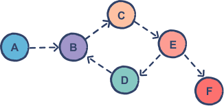
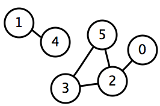

# Instructions

## DFS (Iterative)
Translate the DFS pseudocode into python:
```python
1    procedure DFS_iterative(G, root) is
2      let S be a stack
3      S.push(root)
4      while S is not empty do
5          v := S.pop()         
6          if v is the goal then:
7              return v
8          if v is not labeled as explored then:
9              label v as explored
10             for all edges from v to w in G.adjacentEdges(v) do
11                 if w is not labeled as explored then:
12                     S.push(w)
```

The Python function should take:
- A `graph` (a map from each node to a list of its neighbors)
- A `src` node that you're starting at
- A `dst` node that you're trying to reach

Make your function return `True` if there is a path from the `src` to the `dst`, otherwise `False`.

## DFS (Recursive)

Translate the pseudocode below into Python code:

```python
1   procedure DFS(G, v) is
2      label v as explored
3      for all edges from v to w in G.adjacentEdges(v) do 
4         if w is not labeled as explored then
5             recursively call DFS(G, w)
```

The Python function should take:

A `graph` (a map from each node to a list of its neighbors)
A `src` node that you're starting at
A `dst` node that you're trying to reach
Make your function return `True` if there is a path from the src to the dst, otherwise `False`.

Hint: You may need to write a helper function that takes in the explored set as an extra parameter!

Examples


```
dfs_recursive(graph, 'A', 'E') should return True because if you start at 'A' you can reach 'E'
dfs_recursive(graph, 'E', 'A') should return False because if you start at 'E' you cannot reach 'A'
```

## DFS (Connected Components)

You should use/modify one of your DFS methods from above to write this function!

Let's find the connected components in an undirected graph.

- 2 vertices `u` and `v` are connected if there exists a path from `u` to `v`.
- A graph is connected if for every pair of vertices `u` and `v` in the graph, `u` and `v` are connected.

This problem involves finding sub-graphs, or components of a graph which are connected. You can think of connected components like the islands of a graph.



This is an undirected graph which has 2 connected components:
- {0, 2, 3, 5}
- {1, 4}

Write a function `connected_components`:
- Input: an adjacency-list style graph
- Output: a list of sets with each set containing the nodes of a distinct connected component.

For example, given a graph representing the picture above:
```python
graph = {
  0: [2],
  1: [4],
  2: [0, 3, 5],
  3: [2, 5],
  4: [1],
  5: [2, 3]
}
```

The function should return a list containing the connected components:

`[{0, 2, 3, 5}, {1, 4}]`

You should modify your chosen DFS function to only take a `graph` and a `src` (we don't have a specific `dst` anymore!), and to return the set of all explored nodes (the connected component containing `src`). Then, you'll write the `connected_components` function based off this pseudocode:

```python
procedure find_components(G):
  let components be a list
  for each node v in G:
    if v hasn't been added to any component yet
      component = dfs(v)
      add component to components list
  return components
```