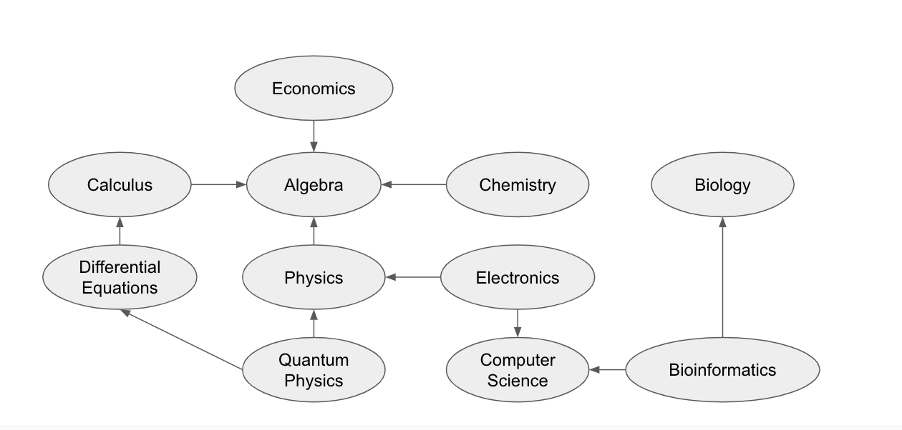
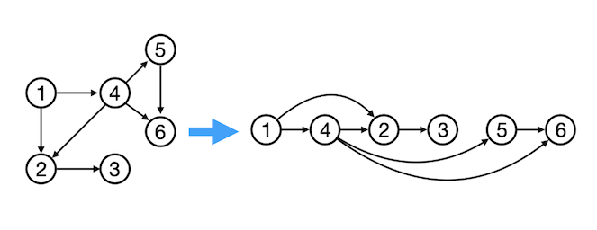
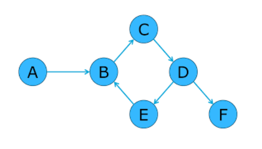

# Instructions  

Choose your fighter! You will be implementing Topological Sort, but you can do it using either BFS or DFS. If you happen to finish, start implementing it the other way.

You've mapped out all of the courses you want to take and their prerequisites. Use Topological Sort to determine a valid ordering of courses!



```python
prerequisites = {
  "Economics": ["Algebra"],
  "Calculus": ["Algebra"],
  "Algebra": [],
  "Chemistry": ["Algebra"],
  "Biology": [],
  "Differential Equations": ["Calculus"],
  "Physics": ["Algebra"],
  "Electronics": ["Physics", "Computer Science"],
  "Quantum Physics": ["Differential Equations", "Physics"],
  "Computer Science": [],
  "Bioinformatics": ["Computer Science", "Biology"]
}
```

An edge from Economics to Algebra means that Economics has a prerequisite of Algebra - you must take Algebra before you are allowed to take Economics!

No matter which version of this problem you choose, you must write a function to `invert` the graph before you can do a logical topological sort! You are not allowed to do this just by hand - your course plan might change in the future and your code needs to be able to adapt!

All graphs used in these problems are represented as adjacency-lists.

## Option 1: DFS

### Invert
Write a function `invert` that returns the inverted version of a graph. Remember that a graph `h` is the inverse of `g` if it has all of the same vertices, but all of the edges are reversed - if there is in edge from `v` to `u` in `g`, there must be an edge from `u` to `v` in `h`.

### Cycle Detection

Follow this pseudocode to implement a cycle detection algorithm on directed graphs:

```
procedure has_cycle(g)
    for all vertices v
        v.status ←  NEW
    for all vertices v
        if v.status = NEW
            if has_cycle_dfs(v):
                return True
    return False
```

Note that `has_cycle` calls a recursive helper function `has_cycle_dfs`:

```
procedure has_cycle_dfs(v, g, status)
    v.status = PRE
    for each edge v → w
        if w.status = PRE
            return True
        if w.status = NEW
            if has_cycle_dfs(w) = True
                return True
    v.status = POST
    return False
```

Examples:

This graph is *acyclic* - it doesn't have a cycle:


This graph has a cycle with the nodes B -> C -> D -> E (-> B).


### Topological Sort

Modify the code you wrote for cycle detection to return a topological sort of a graph. **Copy it and modify it, don't feel like you have to re-write it from scratch!** It should be fairly straightforward to make these modifications, if you find yourself re-writing your code, take a step back. 
- Whenever you mark a node as a dead end (status `POST`), you should add the node to the *front* of a deque since we've already explored all its descendants.
- At the end, convert this deque to a list using the `list()` function and return it.

If you detect a cycle, raise an Exception! There is no valid topological sort of a graph with a cycle.

Since this graph does not contain a cycle, the function should return any valid ordering. Two examples are [1, 4, 5, 6, 2, 3], or, as another example, [1, 4, 2, 3, 5, 6].


This graph contains a cycle, so the function should raise an Exception.


Your function headers should look as follows:

```python
def topological_sort(g)
```
- Takes an adjacency-list style graph and returns a list containing the values in topological order. May raise an exception if the graph contains a cycle.

```python
def topological_sort_helper(v, g, status, result)
```
- Takes a node, the graph, a dictionary mapping each node to its current status, and a deque keeping track of the order, and populates the order deque with the correct values. Does not return anything, but may raise an exception if the graph contains a cycle. Notice that this helper function takes an extra parameter, order, which is the deque you'll be adding to the front of.

## Option 2: BFS

### Invert
Write a function `invert` that returns the inverted version of a graph. Remember that a graph `h` is the inverse of `g` if it has all of the same vertices, but all of the edges are reversed - if there is in edge from `v` to `u` in `g`, there must be an edge from `u` to `v` in `h`.

### Count Indegree
Write a function `indegree` that takes in a graph and returns a dictionary that maps vertex to its indegree. Remember that the indegree of a vertex is the number of edges that lead *to* that vertex. You can do this in one of two ways:
- Iterate through all of the edges, keeping a tally of how many times each vertex appears as the destination of an edge.
- Or, take a look at the graph before you inverted it. Is there a simpler way...?

### Topological Sort
Use the algorithm discussed in class to perform a topological sort! Use the `indegree` method you wrote above to help you. If you detect a cycle, raise an Exception! There is no valid topological sort of a graph with a cycle.

Follow this pseudocode from the lecture:

```
procedure topological_sort(g)
  q = empty queue
  result = empty list
  indegree = dict mapping vertex to indegrees

  enqueue all nodes with indegree = 0

  while q:
    dequeue vertex n
    append n to result
    
    for each edge v → w
      decrement indegree[w]
      if indegree(w) == 0
        enqueue w
```