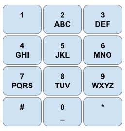

# Phone Number Translation

## Question details

Write a function that takes a 7-digit telephone number and prints out all the possible "words" or combinations of letters that can represent the given numbers, according to the letters associated with each key on the telephone keypad. (Programming Interviews Exposed)

## Example:

## Follow-Up: 

Print only those solutions that are words or combination of words present in a dictionary.

# Fourword Word Game

## Question details
Are you familiar with the game Fourword? We’ll be building the game’s basic functionality.

Given a dictionary of valid words, calculate how many “steps” it would take to go from word A to word B given that a step consists of changing a single letter, and must result in a valid word.

## Example 1

Dictionary: ["boat", "moat", "most", "mist", "miso", "mast", "past", "pest", "best", "west"]

Start: "boat"

Goal: "miso"

Optimal path: “boat” -> “moat” -> “most” -> “mist” -> “miso”

Optimal number of steps: 4

## Example 2

Dictionary: ["aaaa", "aaab", "caab", "aadb", "aacb", "bacb"]

Start: "aaaa"

Goal: "bacb"

Optimal path “aaaa” -> “aaab” -> “aacb” -> “bacb”

Optimal number of steps: 3

## Example 3

Dictionary: ["test", "best", "beat", "bear", "boar"]

Start: "test"

Goal: "boar"

Optimal path “test” -> “best” -> “beat” -> “bear” -> “boar”
Optimal number of steps: 4

## Example 4

Dictionary: ["abc", "cab", "bac", "xyz", "abb", "aab", "bab"]

Start: "bac"

Goal: "abc"

Optimal path “bac” -> “bab” -> “aab” -> “abb” -> “abc”

Optimal number of steps: 4

