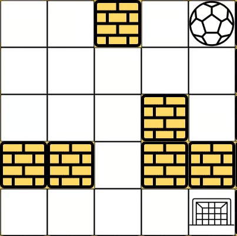
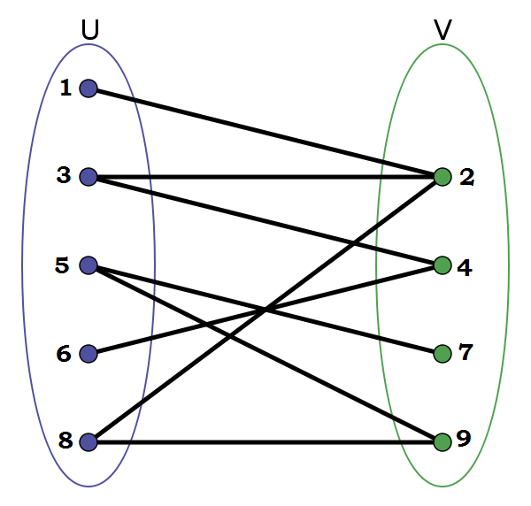
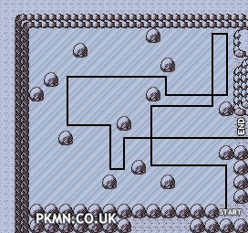
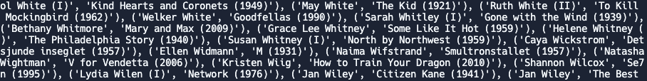
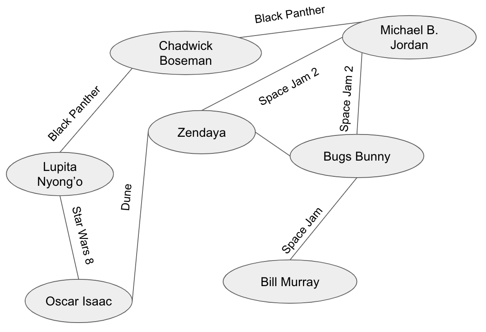

# Graphs Challenge

Today is all about practice with BFS/DFS on graphs. You can tackle these problems in any order, do whichever ones sound interesting to you! There are **way** more problems than it is possible to solve in 95 minutes, just pick a few to try!

You are welcome to copy code from previous exercises from previous days - no need to write BFS or retrace from scratch 3 times if you can just copy/paste/modify. Make sure you decide *before* you start coding if you should use BFS or DFS! You may use BFS, iterative DFS, or recursive DFS (which may just look like backtracking).

These problems are definitely spicier than normal - don't hesitate to ask for help if you're stuck! They are rated on a 🔥 scale from 1 to 3 - more 🔥 means more spice. Pick your starting spice level and go from there!

## 🔥 Flight Itinerary

Solve the flight itinerary problem from [here](https://replit.com/@dgshanker/83-BFS-Shortest-Path).

## 🔥 Connected Components

Solve the connected components problem from [here](https://replit.com/@dgshanker/84-DFS#instructions.md).

## 🔥 Ball Maze 1

There is a ball in a maze with empty spaces (represented as 0) and walls (represented as 1). The ball can go through the empty spaces by moving up, down, left or right, one space at a time. It can't move through walls or out of bounds.

Given the maze, the ball's start position and the destination, where `start = (startrow, startcol)` and `destination = (destinationrow, destinationcol)`, return the shortest path the ball can take from `start` to `destination`.



```
Input: maze = [
  [0,0,1,0,0],
  [0,0,0,0,0],
  [0,0,0,1,0],
  [1,1,0,1,1],
  [0,0,0,0,0]
], start = (0,4), destination = (4,4)
Output: [(0, 4), (0, 3), (1, 3), (1, 2), (2, 2), (3, 2), (4, 2), (4, 3), (4, 4)]
(It's also possible for the first two moves to be different and still have a shortest path.)
```

## 🔥🔥 Longest Increasing Path

Given an integer matrix, return the length of the longest increasing path in the matrix.

From each cell, you can either move in four directions: left, right, up, or down. You may not move diagonally or move outside the boundary. To make an increasing path, you can never move from one number to a number less-than-or-equal-to it.

Example:


```
Input:
[[9, 9, 4],
 [6, 6, 8],
 [2, 1, 1]]
Output: 4
Explnation: The longest path is [1, 2, 6, 9], which has length 4.
```

**Hint:** Can you find the longest increasing path starting at a specific cell?

## 🔥🔥 Bipartite Graph

A graph is called *bipartite* if you can separate all of the vertices into two sets such that no two vertices in the same set are adjacent to each other.



In this graph, you can separate the vertices into two sets `{1, 3, 5, 6, 8}` and `{2, 4, 7, 9}` so that none of the vertices in the same set (like 1 and 3, from the first set) are adjacent to each other.

Given a graph in adjacency list form, determine if the graph is bipartite.

**Note:** Where do we start our search here? You can start it anywhere! To get an arbitrary key from a dictionary `d`, you can use this syntax: `arbitrary_key = list(d.keys())[0]`

**Hint:** If a vertex is in one of two sets, which of the two sets do its neighbors have to be in for the graph to be bipartite?

## 🔥🔥 Ball Maze 2

**Note:** If doing this problem, start with **Ball Maze 1**.

Now, when the ball moves, it won't stop rolling until hitting a wall or a border. When the ball stops, it could choose the next direction.

Modify your Ball Maze code to solve this problem! If you coded Ball Maze with a `get_neighbors` function, you should just be able to modify that!


```
Input: maze = [
  [0,0,1,0,0],
  [0,0,0,0,0],
  [0,0,0,1,0],
  [1,1,0,1,1],
  [0,0,0,0,0]
], start = [0,4], destination = [4,4]
Output: [(0, 4), (0, 3), (1, 3), (1, 0), (2, 0), (2, 2), (4, 2), (4, 4)]
Explanation: One possible way is : left -> down -> left -> down -> right -> down -> right.
```

The most important thing here is writing your `get_neighbors` function! If the ball moves down, what space does it actually end up in? That's your downward neighbor!

You might also recognize this as the Pokemon ice puzzle:



## 🔥🔥🔥 Pacific-Atlantic Water Flow

There is a rectangular island that borders both the Pacific Ocean and Atlantic Ocean. The Pacific Ocean touches the island's left and top edges, and the Atlantic Ocean touches the island's right and bottom edges. You are given a grid of matrix heights where `heights[r][c]` represents the height above sea level of the cell at coordinate `(r, c)`.

The island receives a lot of rain, and the rain water can flow to neighboring cells directly north, south, east, and west if the neighboring cell's height is less than or equal to the current cell's height. Water can flow from any cell adjacent to an ocean into the ocean.

Return a list of all of the grid coordinates in the form `(r, c)` where rain water can flow from that cell to both the Pacific and Atlantic oceans.

Example:

```
Input:
[[1,2,2,3,5],
 [3,2,3,4,4],
 [2,4,5,3,1],
 [6,7,1,4,5],
 [5,1,1,2,4]]

Output: [[0,4],[1,3],[1,4],[2,2],[3,0],[3,1],[4,0]]
Explanation: The following cells can flow to the Pacific and Atlantic oceans, as shown below:
[0,4]: [0,4] -> Pacific Ocean 
       [0,4] -> Atlantic Ocean
[1,3]: [1,3] -> [0,3] -> Pacific Ocean 
       [1,3] -> [1,4] -> Atlantic Ocean
[1,4]: [1,4] -> [1,3] -> [0,3] -> Pacific Ocean 
       [1,4] -> Atlantic Ocean
[2,2]: [2,2] -> [1,2] -> [0,2] -> Pacific Ocean 
       [2,2] -> [2,3] -> [2,4] -> Atlantic Ocean
[3,0]: [3,0] -> Pacific Ocean 
       [3,0] -> [4,0] -> Atlantic Ocean
[3,1]: [3,1] -> [3,0] -> Pacific Ocean 
       [3,1] -> [4,1] -> Atlantic Ocean
[4,0]: [4,0] -> Pacific Ocean 
       [4,0] -> Atlantic Ocean
Note that there are other possible paths for these cells to flow to the Pacific and Atlantic oceans, we just care if there is *any* path.
```

## 🔥🔥🔥 Bacon Game (Full Implementation)

The file `files/imdb-top250.txt` contains lines of text in the form `actor|movie` for every actor in all of the IMDB Top 250 movies (I tried to use a text file with all actors in all movies but repl.it did not like that 259MB file). I've written code in `bacon.py` that reads that file in and constructs a list of tuples of the form `(actor, movie)` for all actor-movie pairs. I would not recommend printing this whole list out due to its size (you can print elements from it if you'd like to see), but it looks something like this:



**VERY IMPORTANT NOTE:** It will be so hard to debug this using the full `files/imdb-top250.txt`. Start by using the `files/imdb-small.txt`, which contains only the example graph below with Bugs Bunny and friends.

From this data, you can build a graph of all actors connected by the movies they're in. You can represent this as an adjacency list of the form:
```
actor1: [(actor2, movie1), (actor3, movie1), (actor4, movie2)]
actor2: [(actor1, movie1), (actor3, movie1)]
actor3: [(actor1, movie1), (actor2, movie1)]
actor4: [(actor1, movie2)]
```

Why is the edge a tuple? It needs to know the actor who is connected, as well as the movie that connects them! This is one form of a *weighted edge*, which we will talk about in greater detail later. There might be multiple edges between two actors (if they were in 2 movies together), but you don't need to treat that any differently in this case. Here's what the graph might look like in theory, although unfortunately Space Jam 2 is probably not in the IMDB Top 250 movies:



Write a function that takes in the names of two actors and returns the shortest path between them in this graph (if one of those actors is Kevin Bacon, you're playing the Bacon Game). You can split this into two main pieces:

1. Build the graph. You basically already did this in 8.1, except now the edges must be tuples containing `(actor, movie)`.
2. Perform a BFS on the graph, retracing your steps once you find the destination.
   - You will have to think about what your queue holds and what your parent dict holds. My queue held just the actor names, but my parent dict mapped actors to weighted edges so that I could retrace the actor/movie chain.

Your solution can be in any format you want, but it should include the actors and movies in the path.

## 🔥🔥🔥 Chicken and Fox

Try this one if you liked the Die Hard problem.

There are 3 chickens, 3 foxes, and 1 boat on one side of the river, and everyone wants to get to the other side of the river. Rules:

- The boat can hold a maximum of two animals at a time
- If there are ever more foxes than chickens on either side of the river, those chickens get eaten. If any chicken gets eaten, you lose. (So for example it's fine for there to be 2 foxes but 0 chickens, but not 2 foxes and 1 chicken.)
- At least one animal must be on the boat in order to row it (the boat can't row itself to the other shore). These animals have hands and are able to operate oars.

Return the shortest path (the solution with the fewest number of boat moves) that gets everyone safely from one side of the river to the other. I won't tell you the solution - you have to find it!

Remember that to solve a BFS problem like this, you need to answer these four questions:

- How are you representing your nodes?
- What are the neighbors of a node?
- What is the start node?
- What is the destination node?

**Hint:** If you know what's on one side of the river, you know (by subtraction) what's on the other side of the river. Does your node actually need to hold information about both sides? The smallest node representation I can think of needs only 3 values.